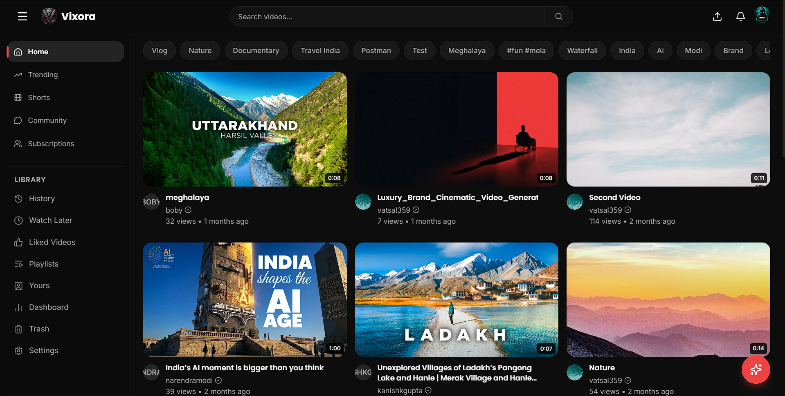
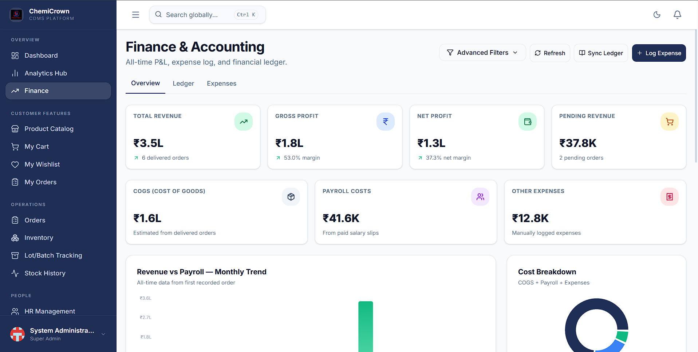
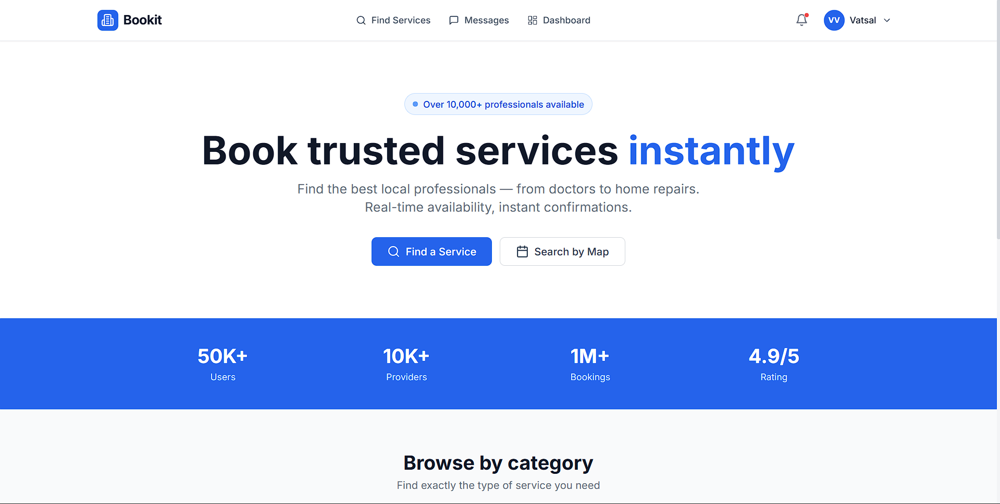
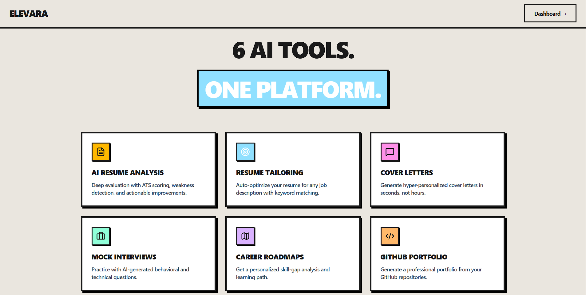

<!-- ═══════════════════════ NAV BAR ═══════════════════════ -->

<a href="https://portfolio.vixora.co.in">PORTFOLIO</a> &nbsp;·&nbsp;
<a href="#-about">ABOUT</a> &nbsp;·&nbsp;
<a href="#-tech-stack">STACK</a> &nbsp;·&nbsp;
<a href="#-featured-work">WORK</a> &nbsp;·&nbsp;
<a href="#-dsa--problem-solving">DSA</a> &nbsp;·&nbsp;
<a href="#-github-stats">STATS</a> &nbsp;·&nbsp;
<a href="#-connect">CONTACT</a>

<!-- ═══════════════════════ QUICK LINKS ═══════════════════════ -->

 

 

<!-- ═══════════════════════ ABOUT ═══════════════════════ -->

## 🚀 About

Computer Science undergraduate at **Nirma University** (B.Tech CSE, 2023–2027 · CGPA **8.29/10**) with hands-on experience building scalable full-stack web applications. Passionate about backend engineering, REST API development, database design, and modern web technologies.

I ship production systems — not class projects. From video-streaming platforms and chemical-distribution ERPs to AI career tools and appointment booking SaaS — every product I build is designed to hold up under real usage.

<table width="100%">
<tr><td width="50%" valign="top">

**What I care about**

- Systems that survive real traffic, not just demos
- Schema design before feature design
- Caching and queues where they earn their complexity
- Clean interfaces — motion and minimalism, not decoration

</td>
<td width="50%" valign="top">

**Quick Facts**

|                |                                                      |
| -------------- | ---------------------------------------------------- |
| 📍 Location    | Ahmedabad, Gujarat, India                            |
| 🎓 Education   | B.Tech CSE — Nirma University                        |
| 💼 Latest Role | Full Stack Developer Intern @ Chemicrown Trading Co. |
| 🏆 Achievement | HackNUthon 6.0 Finalist                              |
| 🗣️ Languages   | English, Gujarati, Hindi                             |

</td>
</tr>
</table>

 

<!-- ═══════════════════════ TECH STACK ═══════════════════════ -->

## 🛠 Tech Stack

<table width="100%">
<tr><th align="left">Languages</th><th align="left">Backend</th><th align="left">Frontend</th><th align="left">Database</th><th align="left">Infrastructure</th></tr>
<tr valign="top">
<td>

</td>
<td>

</td>
<td>

</td>
<td>

</td>
<td>

</td>
</tr>
</table>

 

<!-- ═══════════════════════ FEATURED WORK ═══════════════════════ -->

## 🏗 Featured Work

<table width="100%">
<tr><td>

### 🎬 Vixora — AI-Powered Video Streaming & Analytics

An AI-powered video streaming & analytics platform built with React 19, Node.js, PostgreSQL, and Prisma. Features a custom HTML5 video player, asynchronous video processing queues using Redis and BullMQ, real-time push notifications via Socket.io and Cloudinary media storage. Integrates the Gemini AI API for automated video summaries and interactive transcripts, alongside a personalized feed recommendation engine and a rich user analytics dashboard using Recharts.

|           |                                                                                                                                                                      |
| --------- | -------------------------------------------------------------------------------------------------------------------------------------------------------------------- |
| **Stack** | `React 19` `Node.js` `Express` `PostgreSQL` `Prisma` `Redis` `BullMQ` `Socket.io` `Cloudinary` `Docker` `Kubernetes`                                                 |
| **Links** |    |

</td></tr>
<tr><td>

### 🧪 ChemiCrown CDMS — B2B Chemical Distribution ERP

A comprehensive B2B eCommerce and ERP platform designed for industrial chemical distribution. The system consolidates public product catalogs, client registrations, inventory safety compliance, sales order processing (integrating online and UPI checkouts), and an internal administration dashboard for managing employee attendance and monthly payroll. Built with React (Vite) and Tailwind CSS for a responsive, modern frontend, and Node.js (Express) with PostgreSQL (Supabase) via Prisma ORM for a secure backend.

|           |                                                                                                                                                                                                                                                                                                                                                      |
| --------- | ---------------------------------------------------------------------------------------------------------------------------------------------------------------------------------------------------------------------------------------------------------------------------------------------------------------------------------------------------- |
| **Stack** | `React (Vite)` `Tailwind CSS` `Node.js` `Express` `PostgreSQL (Supabase)` `Prisma`                                                                                                                                                                                                                                                                   |
| **Links** |   |

</td></tr>
<tr><td>

### 📅 Bookit — Service Booking Platform

An appointment booking platform for healthcare and personal services with role-based access for customers, service providers, and organizations. Integrated location-based search, scheduling, and payment workflows using Node.js, Express, PostgreSQL, and Prisma.

|           |                                                                                                                                                               |
| --------- | ------------------------------------------------------------------------------------------------------------------------------------------------------------- |
| **Stack** | `Node.js` `Express` `PostgreSQL` `Prisma`                                                                                                                     |
| **Links** |    |

</td></tr>
</table>

<table width="100%">
<tr><td>

### 🤖 Elevara — AI Career Operating System

Developed Elevara, an AI Career OS for resume building, ATS scoring, and cover letter generation. Implemented async parsing queues via Redis/BullMQ, AI mock interviews and roadmaps using Gemini API, and a Chrome extension for real-time LinkedIn/Naukri job fit analysis. Built with Next.js, Express, and Prisma/Supabase; integrated Razorpay and Zustand. Improved resume tailoring efficiency.

|           |                                                                                                                                                               |
| --------- | ------------------------------------------------------------------------------------------------------------------------------------------------------------- |
| **Stack** | `React.js` `Next.js` `Node.js` `Express.js` `PostgreSQL` `Prisma ORM` `Supabase` `Redis` `BullMQ` `Gemini AI API` `RESTful APIs` `Tailwind CSS` `Zod`         |
| **Links** |    |

</td></tr>
</table>

<b>🔭 More Projects</b>

 

**Reve-soil-1.0 — HackNUthon 6.0 Finalist** · Built a soil analysis system to predict NPK, moisture & pH from spectrometer data. Designed end-to-end data preprocessing and feature engineering pipelines in Python; compared Random Forest, CatBoost, LightGBM, and TensorFlow models, achieving an R² of 0.89.
`Python` `Pandas` `NumPy` `TensorFlow` `XGBoost` `LightGBM` — 

**Secure P2P Communication Network** · A C++ peer-to-peer messaging system with user authentication, encrypted storage, and contact management using efficient data structures and file handling.
`C++` `Data Structures` `File Handling`

 

<!-- ═══════════════════════ DSA ═══════════════════════ -->

## 🧠 DSA & Problem Solving

<table width="100%">
<tr><td width="50%" valign="top">

| Platform       | Max Rating | Profile                                                                                                                              |
| -------------- | ---------- | ------------------------------------------------------------------------------------------------------------------------------------ |
| **Codeforces** | **1150**   |  |
| **LeetCode**   | **1694**   |   |

DSA is a parallel track to product work — daily solving to keep fundamentals sharp for backend system design and interview readiness, not a one-time prep sprint.

</td><td width="50%" valign="top">

</td></tr>
</table>

> 📌 LeetCode card rendered by [leetcard.jacoblin.cool](https://leetcard.jacoblin.cool) — if it's ever down, the ratings table serves as fallback.

 

<!-- ═══════════════════════ CURRENT FOCUS ═══════════════════════ -->

## 🎯 Current Focus

| Area                     | Status                   |
| ------------------------ | ------------------------ |
| 🎓 Placement Preparation | `In Progress`            |
| 🏗️ Backend System Design | `In Progress`            |
| 🐳 Docker                | `Applying in Production` |
| ☸️ Kubernetes            | `Learning`               |

 

<!-- ═══════════════════════ EXPERIENCE ═══════════════════════ -->

## 💼 Experience

<table width="100%">
<tr><td>

### Chemicrown Trading Co. — Full Stack Developer Intern

`May 2026 – Jun 2026` · IT / Computers - Software

Developed **ChemiCrown CDMS**, a comprehensive B2B eCommerce and ERP platform designed for industrial chemical distribution. Built with React (Vite) and Tailwind CSS frontend, Node.js (Express) with PostgreSQL (Supabase) via Prisma ORM backend.

**Key Skills:** `Node.js` `PostgreSQL` `Express.js` `Socket.io` `Tailwind CSS` `REST` `Git` `React.js` `Prisma` `Zod`

</td></tr>
</table>

 

<!-- ═══════════════════════ HACKATHONS ═══════════════════════ -->

## 🏆 Hackathons & Achievements

| Event                                  | Role                                                           | Date     |
| -------------------------------------- | -------------------------------------------------------------- | -------- |
| **HackNUthon 6.0** — Finalist          | Developer · Soil Analysis System (R² = 0.89)                   | Mar 2025 |
| **MINeD Hackathon** — Nirma University | Developer · AI-powered real-time image analysis web app        | Feb 2025 |
| **Build with India Hackathon**         | Developer · Full-stack web app for digital challenges in India | Apr 2025 |

 

<!-- ═══════════════════════ GITHUB STATS ═══════════════════════ -->

## 📊 GitHub Stats

  

<!-- Contribution Snake Animation -->
<picture>
  <source media="(prefers-color-scheme: dark)" srcset="https://raw.githubusercontent.com/vatsal3030/vatsal3030/output/dist/snake-dark.svg" />
  
</picture>

🐍 Snake animation powered by the <code>.github/workflows/snake.yml</code> GitHub Action — run it once manually after pushing (Actions tab → Generate Snake Animation → Run workflow).

 

<!-- ═══════════════════════ CONNECT ═══════════════════════ -->

## 🌐 Connect

 

<!-- ═══════════════════════ FOOTER ═══════════════════════ -->

⭐ _"Build products, not just projects."_ ⭐

